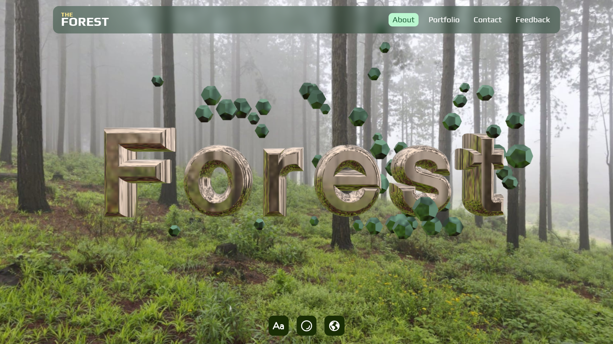

<h1 align="center">Three.js + Cannon.js</h1>

<div align="center" id="top"> 
  
</div>
&#xa0;

<p align="center">
  

  

  

  

  
</p>

<p align="center">
  <a href="#dart-about">About</a> &#xa0; | &#xa0; 
  <a href="#sparkles-features">Features</a> &#xa0; | &#xa0;
  <a href="#rocket-technologies">Technologies</a> &#xa0; | &#xa0;
  <a href="#white_check_mark-requirements">Requirements</a> &#xa0; | &#xa0;
  <a href="#checkered_flag-starting">Starting</a> &#xa0; | &#xa0;
  <a href="#memo-license">License</a> &#xa0; | &#xa0;
  <a href="https://github.com/matmon12" target="_blank">Author</a>
</p>

<br>

## :dart: About

Website using 3D graphics and physics libraries. The scene contains 3D letters with collision and dodecahedron figures, also with collision. The figures move after the cursor. There is also a slight camera movement when moving the cursor. There are small settings for changing some parameters.

## :sparkles: Features

:heavy_check_mark: Movement of figures following the cursor;\
:heavy_check_mark: Camera movement when moving cursor;\
:heavy_check_mark: Changing text, figure material and environment map.

## :rocket: Technologies

The following tools were used in this project:

- [Vue](https://vuejs.org/)
- [VueUse](https://vueuse.org/)
- [Pinia](https://pinia.vuejs.org/)
- [Vite](https://vitejs.dev/)
- [Vue-router](https://router.vuejs.org/)
- [TroisJS](https://troisjs.github.io/?ref=madewithvuejs.com)
- [Cannon-es](https://pmndrs.github.io/cannon-es/)
- [Lodash.debounce](https://lodash.com/)
- [Three.js](https://threejs.org/)

## :white_check_mark: Requirements

Before starting :checkered_flag:, you need to have [Git](https://git-scm.com) and [Node](https://nodejs.org/en/) installed.

## :checkered_flag: Starting

```bash
# Clone this project
$ git clone https://github.com/matmon12/physic-3d

# Access
$ cd physic-3d

# Install dependencies
$ npm install

# Run the project
$ npm run dev

# Compiles and minifies for production
$ npm run build
```

### Vue 3 + Vite

This template should help get you started developing with Vue 3 in Vite. The template uses Vue 3 `<script setup>` SFCs, check out the [script setup docs](https://v3.vuejs.org/api/sfc-script-setup.html#sfc-script-setup) to learn more.

### Recommended IDE Setup

- [VS Code](https://code.visualstudio.com/) + [Volar](https://marketplace.visualstudio.com/items?itemName=Vue.volar) (and disable Vetur) + [TypeScript Vue Plugin (Volar)](https://marketplace.visualstudio.com/items?itemName=Vue.vscode-typescript-vue-plugin).

## :memo: License

This project is under license from MIT. For more details, see the [LICENSE](LICENSE) file.

Made with :heart: by <a href="https://github.com/matmon12" target="_blank">Matmon</a>

&#xa0;

<a href="#top">Back to top</a>
